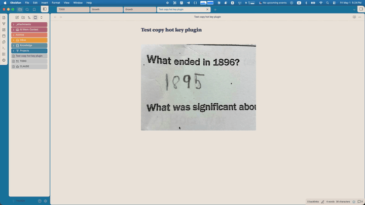

# Copy Image Hotkey

Cmd+C (or Ctrl+C) copies the **actual image** to your clipboard when an image embed is selected in an Obsidian note — instead of copying the wikilink text.

## Why

By default, selecting `![[my-photo.png]]` in source mode and pressing Cmd+C copies the literal text `![[my-photo.png]]`. If you want to paste the image into another app (Slack, Mail, Figma, etc.), you have to right-click and "Copy image" from the rendered preview, which breaks flow.

This plugin makes Cmd+C just work: select the image embed, copy, paste anywhere.

## Demo

<!-- TODO: replace with a real demo GIF before announcing -->

## How it works

The plugin listens for the system copy event. When the current selection is either:

1. text matching `![[filename.ext]]` (source mode), or
2. a rendered `` element (Live Preview),

it intercepts the copy, reads the image binary from your vault, and writes it to the clipboard as the correct MIME type. SVGs are written as text. Everything else is written as `Blob`.

Supported formats: PNG, JPG/JPEG, GIF, BMP, TIFF, WebP, SVG.

## Install

### From the Obsidian community plugins (post-approval)

1. Settings → Community Plugins → Browse
2. Search for "Copy Image Hotkey"
3. Install and enable

### Pre-approval (via BRAT)

While the plugin is awaiting community-plugin approval, install via [BRAT](https://github.com/TfTHacker/obsidian42-brat):

1. Install and enable BRAT from the community plugin browser
2. BRAT settings → "Add Beta plugin"
3. Paste: `aliir74/copy-image-hotkey`
4. Enable Copy Image Hotkey under Settings → Community Plugins

### Manual install

1. Download `main.js`, `manifest.json`, and `styles.css` from the [latest release](https://github.com/aliir74/copy-image-hotkey/releases/latest)
2. Drop them into `<your-vault>/.obsidian/plugins/copy-image-hotkey/`
3. Reload Obsidian → Settings → Community Plugins → enable Copy Image Hotkey

## Notes

- Desktop-only (uses the `navigator.clipboard.write` API with `ClipboardItem`).
- The plugin doesn't bind a custom hotkey — it intercepts the existing system copy. If you've remapped copy elsewhere, the plugin will still trigger off whichever key fires the `copy` event.

## License

MIT — see [LICENSE](LICENSE).
